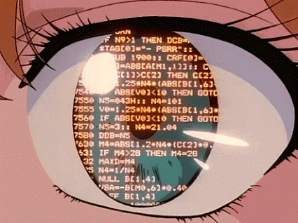

# Julia Shizuko

**Software Engineer**

Comecei achando que software era código. Hoje penso mais em software como a representação de um sistema que já existe. Pessoas, regras e restrições que estavam lá antes de qualquer linha ser escrita.

Isso mudou menos o que eu escrevo e mais a ordem em que eu faço as coisas.

 

## Como eu trabalho

**Tento ver a operação antes de modelar.**
O problema que chega escrito raramente é o problema inteiro. Quando dá, eu vou olhar de perto antes de decidir a estrutura. Nem sempre dá, e aí é chute informado mesmo.

**Deixo o domínio guiar a arquitetura.**
Nomear as entidades como o negócio as nomeia poupa muita tradução depois. Quando o modelo espelha o mundo, a arquitetura briga menos com o produto.

 

**Gosto de conseguir explicar o porquê.**
Principalmente em ranking e relevância: se eu não consigo explicar por que algo subiu, normalmente é sinal de que eu não entendi o suficiente ainda.

**Traduzo para quem não é técnico.**
Análise só vira decisão quando atravessa a mesa. Acho isso parte do trabalho, não um extra.

**Ainda estou aprendendo a calibrar.**
Discovery demais também trava entrega. Uma parte boa da senioridade, pra mim, tem sido descobrir quando parar de investigar e começar a escrever.
